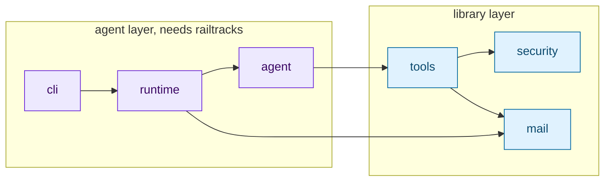

# Emalia documentation

**Emalia** is a Python email agent and IMAP/SMTP toolkit: point it at a mailbox
and it answers what arrives, or import `emalia.mail` and use the email layer on
its own.

## Start here

| | |
|---|---|
| [Quick start](quickstart.md) | From `pip install` to a working assistant, in ten minutes |
| [Authentication](authentication.md) | App passwords and OAuth, and which one you want |
| [Configuration](configuration.md) | Every setting, environment variable and precedence rule |
| [Toolkit reference](toolkit.md) | `emalia.mail` in full — the library half |
| [Design](design.md) | Architecture, layer rules, and the mapping from the 2023 code |
| [Security](../SECURITY.md) | Threat model, hardening, and what is out of scope |
| [End-to-end testing](e2e-testing.md) | Running the suite against a real mailbox |

## By what you are trying to do

**"I want an assistant on an email address."**
[Quick start](quickstart.md) → [Configuration](configuration.md) →
[Security](../SECURITY.md).

**"It will not log in to the mailbox."**
[Authentication](authentication.md). App passwords cannot be created by any
API, and an OAuth token from an unverified app expires after seven days — both
are covered there.

**"I just want a decent IMAP/SMTP library."**
[Toolkit reference](toolkit.md), and
[examples/01_toolkit_only.py](../examples/01_toolkit_only.py). You will not
need an API key, and railtracks is never imported.

**"I have an agent already and want it to handle email."**
[examples/02_mail_tools_in_your_agent.py](../examples/02_mail_tools_in_your_agent.py),
then the tool sections of [Design](design.md).

**"I want to give it abilities of my own."**
[examples/03_custom_tools.py](../examples/03_custom_tools.py). Write a function
with type hints and a docstring; pass it as `extra_tools`.

**"I need to know what it can reach before I run it."**
[Security](../SECURITY.md), and `emalia check`, which prints the resolved
policy.

## The shape of it

Dependencies only ever point downward, and the boundary is real: importing
`emalia.mail` does not load railtracks or any provider SDK.

## Assets

`assets/` holds the logo, the README banner and the animated terminal demo.
The demo is generated — edit `scripts/render_demo.py` and re-run it rather than
hand-editing the SVG.
