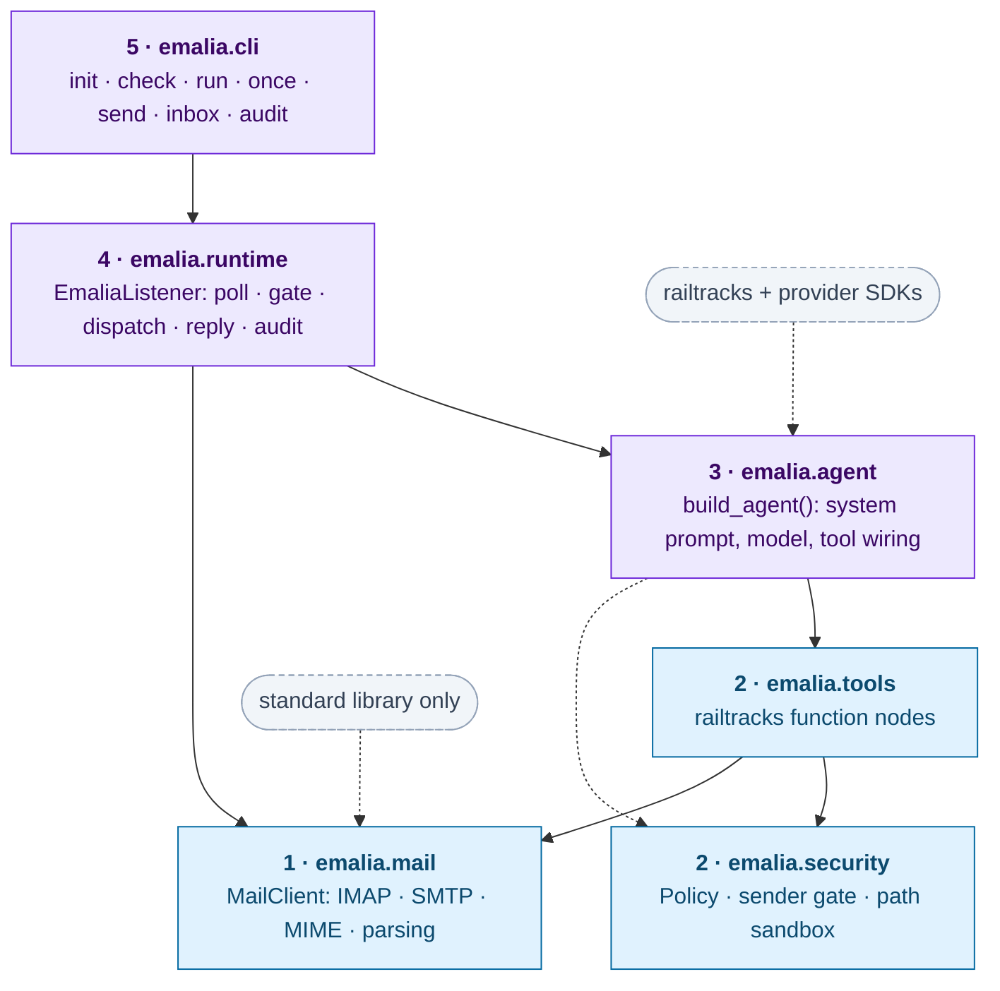
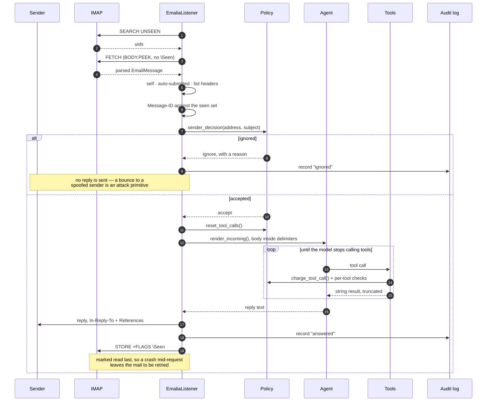

# Emalia Design

Version: 0.4.0

Emalia is an agent that lives in an email inbox, plus the email toolkit that
makes that possible. Both halves ship in one package and are usable
independently: you can run the agent as a daemon, or import `emalia.mail` into
an unrelated agent and never touch the runtime.

## 1. Goals

1. **An agent in your inbox.** Send the account an email in plain English, get
   a reply that has actually done the work. No command grammar to memorise.
2. **A reusable email toolkit.** `emalia.mail` is a typed, dependency-light
   IMAP/SMTP layer with no knowledge of agents or LLMs. `emalia.tools` wraps it
   as `railtracks` function nodes any agent can import.
3. **Safe by construction.** An inbox is a public endpoint. Anyone can mail it.
   The design assumes every incoming body is hostile text, and gates capability
   outside the model rather than inside the prompt.

## 2. Layers



Each layer depends only downward. `emalia.mail` imports nothing from
`railtracks`, so the toolkit stays useful to people on other frameworks.

The rule is enforced by cost rather than convention, which is why it holds.
Measured on a warm cache, `import emalia.mail` takes about 0.1 s and leaves
`railtracks` absent from `sys.modules`; `import emalia.agent` takes about 4 s,
because the provider SDKs come with it, and considerably longer on a cold first
import. `emalia/__init__.py` therefore exposes the agent and runtime names
through a lazy `__getattr__`, so `import emalia` alone does not drag the agent
stack in.

## 3. Layer 1: `emalia.mail`

The part that replaces the original `EmailManager`.

| Module | Responsibility |
|---|---|
| `accounts.py` | `MailAccount`: credentials plus SMTP/IMAP endpoints, with provider presets for gmail, outlook, yahoo, icloud, fastmail, zoho and proton. |
| `oauth.py` | `OAuthCredentials` and `ServiceAccountCredentials`: refresh-token exchange, RS256 assertions for domain-wide delegation, in-memory access-token caching, the XOAUTH2 SASL string, credential resolution from the environment, and the `OAuthProvider` records that hold what differs between identity providers. |
| `folders.py` | Modified UTF-7 (RFC 3501 §5.1.3) for mailbox names, and IMAP quoting. |
| `models.py` | `EmailAddress`, `Attachment`, `EmailMessage`, `EmailSummary`. Plain dataclasses, no MIME leakage. |
| `parse.py` | Raw RFC 822 bytes to `EmailMessage`. RFC 2047 header decoding, charset fallbacks, HTML to text, quoted-reply stripping. |
| `compose.py` | `EmailMessage` to MIME. New, reply (with `In-Reply-To` and `References`), forward. Directory attachments are zipped. |
| `imap.py` | `ImapSession`: a reconnecting context manager over `imaplib`. Search, fetch, flags, folders, move, delete. |
| `smtp.py` | `SmtpSender`: a context manager over `smtplib`, SSL and STARTTLS. |
| `client.py` | `MailClient`: the single facade, and the public import. |

### Authentication

`MailAccount` carries exactly one credential: a password, or something
satisfying `TokenCredentials`. Two at once is rejected at construction rather
than resolved by precedence, because that combination is what a half-finished
migration looks like and choosing silently hides it.

Token credentials go over XOAUTH2, the SASL mechanism Google and Microsoft both
implement for IMAP and SMTP. Two implement it, and the split is the important
part of this design:

| | Obtained by | Expires | Suits |
|---|---|---|---|
| `OAuthCredentials` | A browser consent flow | Yes, and after seven days on an unverified app | A workstation |
| `ServiceAccountCredentials` | Signing an assertion with a private key | No | A deployed system |

The second exists because the first cannot serve an unattended process
honestly. A refresh token has to be minted by a human at a browser and can
expire, which means a production deployment eventually pages someone to go and
click something. A service account key is created by `gcloud`, rotated by
`gcloud`, and never expires — the authorisation lives in a delegation an
administrator granted once, not in the credential.

`TokenCredentials` is a `Protocol` rather than a base class so the IMAP and
SMTP sessions never learn which kind they hold. They ask for `access_token()`
and build the same SASL string either way.

`oauth.py` uses `urllib` rather than `requests`, so the claim that
`emalia.mail` needs nothing beyond the standard library survives. The one
exception is the RS256 signature a service account assertion needs, which the
standard library cannot produce; `cryptography` is imported lazily inside the
signing function and ships as the optional `gcp` extra, so the two paths that
never sign anything pull in nothing.

The interactive consent flow lives in `emalia.auth`, one layer up, not here.
The mail layer needs a refresh token and nothing else; opening a browser and
running a loopback web server is a setup-time concern that a library embedding
the toolkit should never have linked in.

Several sources feed the same credential — an environment triple, a file path,
inline JSON, or the flow that writes a file — because the deployment shapes
genuinely differ. A container has a secret store and no filesystem; a
workstation has the reverse. See [authentication.md](authentication.md).

### Providers

The consent flow is plain RFC 6749 with PKCE, which every provider implements
the same way. What differs is three strings — the authorization endpoint, the
token endpoint, and the scope that grants mailbox access — so those are
gathered into `OAuthProvider` records rather than branched on at each call site.
Adding a provider is a record and a CLI sub-app, not a new code path.

Each provider writes its own token file, so authorising Google and Microsoft on
one machine does not have the second overwrite the first.

Microsoft has no analogue of the service account path. Its unattended
credential is the client credentials grant with application permissions, which
needs a tenant-wide admin grant and an application access policy to bound which
mailboxes it reaches — a different mechanism, deliberately left out rather than
approximated.

### Mailbox names

RFC 3501 encodes mailbox names in a modified UTF-7: printable ASCII stands for
itself, everything else is BASE64-encoded UTF-16BE between `&` and `-`, with
`,` substituted for `/` so the result survives the hierarchy delimiter. Python
ships a `utf-7` codec, but it is the unmodified RFC 2152 one and emits `+`
where IMAP requires `&`, so `folders.py` implements the variant directly.

Encoding is applied unconditionally on the way out, since an ASCII name passes
through unchanged. `select()` keeps the decoded name on the session, because
that is what error messages and a reconnect use.

`list_folders()` reads names sent as IMAP literals as well as quoted and atom
forms. The literal is the form servers use for precisely the non-ASCII names
this exists to support, so skipping it would have left the gap half-closed. A
name that will not decode is returned raw and logged rather than dropped: one
malformed entry should not silently shorten the listing.

### Why a facade

The original opened a fresh IMAP connection per operation, paying roughly a
second of login time on every call. `MailClient` holds one session open across
a batch and reconnects on `imaplib.IMAP4.abort`, which is what servers actually
raise when they drop an idle connection.

### Quoted-reply stripping

The original left `split_by_reply` as a stub. Feeding a whole quoted thread to
a model wastes tokens and, worse, re-feeds the model its own earlier output as
though it were fresh user input. `parse.strip_quoted_reply` removes:

- `On <date>, <person> wrote:` attribution blocks and everything after them,
- runs of lines led by `>`,
- `-----Original Message-----` blocks,
- client containers (`gmail_quote`, `moz-cite-prefix`) on the HTML path.

## 4. Layer 2: tools and policy

### Toolsets

Tools are grouped, and each group is enabled or disabled by policy. A disabled
group is never constructed, so the model never sees it and cannot be talked
into it.

| Toolset | Tools | Default |
|---|---|---|
| `email` | `list_inbox`, `read_email`, `search_email`, `send_email`, `reply_to_email`, `forward_email`, `mark_email`, `list_folders`, `save_attachments` | on |
| `file_read` | `read_file`, `list_directory`, `search_files`, `file_info` | on |
| `file_write` | `write_file`, `delete_file` | off |
| `http` | `http_request` | off |
| `shell` | `run_shell` | off |
| `python` | `run_python` | off |

`run_shell` and `run_python` exist because the original had them and they are
genuinely useful on a machine you own. They are off by default, they refuse to
turn on unless `allow_dangerous_tools` is set as well as the toolset, and
enabling them logs a warning naming the risk.

### Policy

`emalia.security.Policy` holds every limit in one object:

- `allowed_senders` / `blocked_senders`: glob patterns matched against the
  envelope sender. An empty allowlist makes the listener refuse to start unless
  `allow_any_sender` is set explicitly.
- `sandbox_roots`: absolute paths the file tools may touch. Containment is
  checked on the resolved real path, so symlinks cannot escape.
- `max_attachment_bytes`, `max_total_attachment_bytes`.
- `max_replies_per_run`, `max_replies_per_hour`: runaway loop guards.
- `allowed_recipients`: who `send_email` may address. Defaults to "whoever
  wrote in, and nobody else".
- `enabled_toolsets`, `allow_dangerous_tools`.
- `require_token`: an optional shared secret that must appear in the subject.

Policy is consulted inside each tool, so a tool called directly from another
framework is gated exactly as it is inside Emalia.

## 5. Layer 3: the agent

`build_agent(config)` returns a `railtracks` node type. It is deliberately
thin:

```python
Agent = rt.agent_node(
    config.instance_name,
    tool_nodes=build_toolset(config),
    llm=resolve_llm(config),
    system_message=render_system_prompt(config),
)
```

Everything interesting lives in the tools and the prompt. The prompt states the
instance identity, the enabled capabilities, the sandbox roots, and the
untrusted-input rule.

## 6. Layer 4: the runtime

`EmaliaListener` runs the loop the original `main_loop` sketched, with the gaps
filled in:

1. Poll IMAP for unseen mail on an interval.
2. Drop anything from the account itself (self-reply loops), from a blocked
   sender, or from a sender outside the allowlist. Dropped mail is flagged read
   and logged but never answered: a bounce to a spoofed sender is itself an
   attack primitive.
3. Deduplicate on `Message-ID` against a persisted seen-set, so a crash
   mid-batch does not produce a double answer on restart.
4. Invoke the flow with the parsed, quote-stripped body wrapped in an
   untrusted-content envelope.
5. Reply in-thread with the result. Failures reply with a short message and log
   the traceback locally; the traceback never leaves the machine.
6. Append an audit record to a JSONL log.

Emails are processed one at a time by default. Raising `max_concurrent` opens
one `FlowConnection` per in-flight email, which is what railtracks requires for
concurrent runs of one flow.



The ordering in that last block is the part worth defending. Marking read on
receipt is the obvious implementation and it silently loses mail on any failure
between fetch and reply.

## 7. Layer 5: the CLI

| Command | Purpose |
|---|---|
| `emalia init` | Write a starter `emalia.toml` and `.env` in the current directory. |
| `emalia check` | Verify IMAP login, SMTP login, LLM credentials, and policy sanity. Exits non-zero on the first failure. |
| `emalia run` | Start the listener until interrupted. |
| `emalia once` | Process at most one batch and exit. Suits cron and CI. |
| `emalia send` | Send one email from the configured account. A toolkit smoke test. |

## 8. Configuration

`EmaliaConfig` is a pydantic model resolved from, in increasing precedence:
built-in defaults, `emalia.toml`, environment variables (`EMALIA_*`), then
constructor arguments. Secrets are only ever read from the environment or a
`.env` file; nothing secret is written to `emalia.toml`.

## 9. Threat model

The inbox is unauthenticated and world-reachable. Assume an attacker can put
arbitrary text, HTML, and attachments in front of the model, and can spoof a
`From` header.

| Threat | Mitigation |
|---|---|
| Prompt injection in a body | The body is delimited and labelled untrusted in the prompt, and capability is enforced by tool registration rather than by the model's cooperation. |
| Spoofed allowlisted sender | The allowlist is a filter, not authentication. `require_token` adds a shared secret in the subject. DKIM and SPF verification is left to the mail provider, which is where it belongs. |
| Exfiltration by asking the agent to mail a file elsewhere | `allowed_recipients` defaults to the original sender. |
| Path traversal in a file request | `sandbox_roots` with resolved-path containment. |
| Mail loop between two agents | Self-address drop, `Message-ID` dedupe, and a per-hour reply cap. |
| Runaway cost | `max_replies_per_run` plus railtracks `MaxCalls` middleware on the agent. |

Full detail is in `SECURITY.md`.

## 10. Mapping from the original

| Original | Now |
|---|---|
| `EmailManager` | `emalia.mail.MailClient` and friends |
| `FileManager` | `emalia.tools.file_tools` plus `emalia.security.paths` |
| `Emalia.task_list` keyword dispatch (`READ/1`, `WRITE/2`, ...) | Natural language plus the tool schema; the keywords are gone |
| `_action_gpt_request` | The agent itself |
| `_action_register_custom_task` | Bring your own `@rt.function_node` and pass it to `build_agent(extra_tools=...)` |
| `gpt_request.py` | `railtracks` LLM providers |
| `emalia_setting.json` | `EmaliaConfig`, `emalia.toml`, `EMALIA_*` |
| `permission` dict | `emalia.security.Policy` |

## 11. Testing strategy

Two suites, split by what they can actually prove.

| | `tests/` | `tests/e2e/` |
|---|---|---|
| Count | 190 | 38 |
| Talks to | fakes | a real mail server, a real model |
| Runtime | ~6 s | 2–4 minutes |
| Runs in CI | yes, on 3 OSes × 3 Pythons | no, on demand |
| Answers | "does our logic hold?" | "does the protocol agree with us?" |

The offline suite covers parsing, policy, composition, tools, the listener's
gate, config precedence and the CLI. It uses fakes for IMAP and SMTP, which
makes it fast and hermetic — and structurally unable to catch a provider that
quotes `SEARCH` arguments differently or a `STORE` verb that silently does
nothing.

The end-to-end suite exists for exactly those. Everything in it is a round
trip: something is sent, it is waited for, and what comes back is inspected.
Its most useful members are the four prompt-injection tests, which assert not
that the model refuses but that the capability was never registered — the only
claim that survives a better-worded attack.

Three containment choices make it safe to run against a mailbox that may hold
real mail: it reads only `EMALIA_E2E_*` credentials, it tags every subject with
a per-run id and cleans up only matching messages after re-reading their
subjects, and it sets `Policy.require_token` to that tag so the agent cannot
answer mail the suite did not send. See [e2e-testing.md](e2e-testing.md).

The CLI has its own regression guard worth noting. Typer builds a command's
parameters at registration time, so a mistake there is invisible until the
binary runs — and one bad command takes down the whole CLI, `--help` included.
`test_every_command_builds` invokes `--help` on each command for that reason.

## 12. Non-goals for 0.1.0

- No webmail UI. The inbox is the UI.
- No OAuth device flow. App passwords and `LOGIN` auth only; XOAUTH2 is a
  tracked follow-up.
- No IMAP IDLE. Polling is simpler and survives flaky NAT; IDLE is a tracked
  follow-up.
